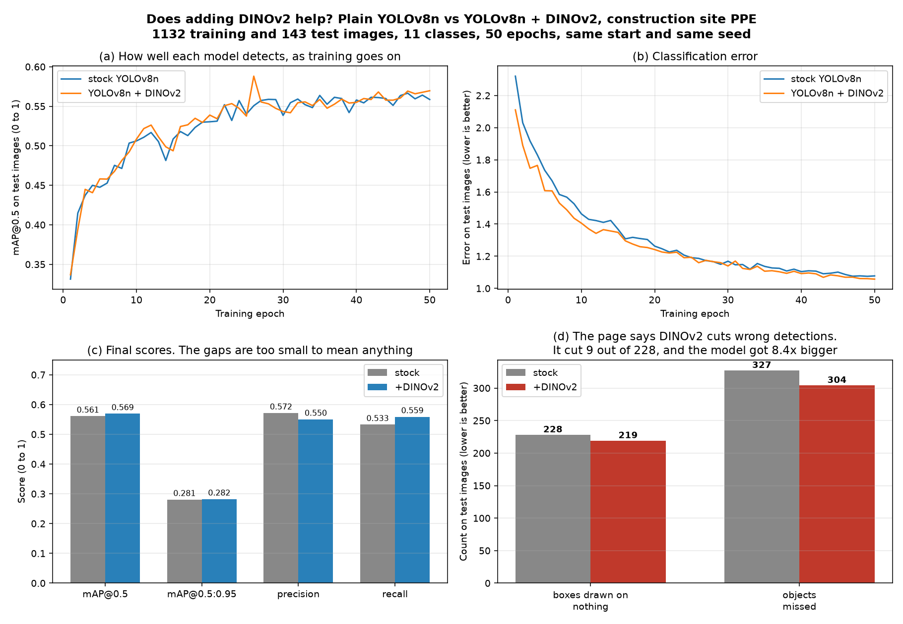

# YOLOv8 + DINOv2 and YOLOv8 + Depth Anything V2

Assignment for the Intelligent User Interfaces course at IISc.

The two projects are based on
[this page](https://cambum.net/I3DLab/AI4DM.htm).

1. **YOLOv8 + DINOv2.** DINOv2 looks at the whole picture and passes a summary of it into
   YOLO, so the detector gets a hint about what kind of scene it is looking at.
2. **YOLOv8 + Depth Anything V2.** Working out how far apart two objects are using just one
   camera.



## What I found

I used the **construction-ppe** dataset: 1,132 training images, 143 test images, 11 classes
(helmet, gloves, vest, boots, goggles, Person, and the matching "not wearing it" classes).

The page says the DINOv2 part helps get rid of wrong detections. I wanted to check that, so
I trained two models the same way, from the same starting weights and the same random seed,
for 50 epochs each. The only difference was the DINOv2 part.

| | mAP@0.5 | mAP@0.5:0.95 | precision | recall | wrong detections | missed |
|---|---|---|---|---|---|---|
| YOLOv8n | 0.561 | 0.281 | 0.572 | 0.533 | 228 | 327 |
| YOLOv8n + DINOv2 | 0.569 | 0.282 | 0.550 | 0.559 | 219 | 304 |

**The gap is too small to mean anything.** DINOv2 gave 9 fewer wrong detections out of 228,
but the model got 8 times bigger and took about 4 times longer to train. With one run and 143
test images you would get swings that big just by luck. So I could not show that DINOv2 helps
here, and I could not show it hurts either.

The part that did work well was reusing the ready-made YOLOv8n weights. With those, the
combined model scores 0.8887 on COCO8 before any training at all, against 0.8875 for plain
YOLOv8n. So adding DINOv2 costs nothing to start with.

For the second project I ran the trained detector over 60 site photos along with Depth
Anything V2 and measured how far apart two workers were. I calculated the distance two ways,
using the formula from the page and a normal 3D distance. They do not match, because the
page's formula only looks at left-right angle and ignores height.

## Problems I ran into

The code on the page did not run for me as it was written, so a fair bit of this was fixing
it before anything worked.

The two new pieces of code would not build at all, and even after that the model was quietly
being put together at the wrong size, which did not show up as an error until much later. The
page also only shows the first half of the model, so I had to work out the second half
myself, since adding a block at the start moves every layer along by one.

Getting the ready-made weights to load was the fiddliest bit. Because the layers had moved,
only 7 values out of 355 were being copied across, and one new layer in the middle started
off random and undid everything the good weights were doing. The score sat at 0.170 until I
sorted that out, then it went back up to 0.889.

In the second project the depth code crashed straight away, and once it ran I realised it was
reading a picture of the depth rather than the actual depth numbers, so the distances it gave
were meaningless. The model the page points at also gives depth the wrong way round, with
bigger meaning closer, so I had to switch to the version that gives real metres. The distance
calculation the page describes is never actually written in its code either, so I wrote it.

## Running it

Needs Python 3.12 and an Nvidia GPU.

```bash
python -m venv .venv
.venv/Scripts/python -m pip install torch torchvision --index-url https://download.pytorch.org/whl/cu124
.venv/Scripts/python -m pip install transformers tqdm
git clone https://github.com/ultralytics/ultralytics.git ultralytics_repo
.venv/Scripts/python -m pip install -e ./ultralytics_repo
.venv/Scripts/python assignment1_yolo_dino/patch_ultralytics.py --repo ultralytics_repo
```

Then train, compare the two models, or run the depth part:

```bash
.venv/Scripts/python assignment1_yolo_dino/train_dino.py --data construction-ppe.yaml --epochs 50 --batch 8
.venv/Scripts/python assignment1_yolo_dino/ab_experiment.py --data construction-ppe.yaml --epochs 50 --batch 8
.venv/Scripts/python assignment2_yolo_depth/yolo_depth_distance.py --source assignment2_yolo_depth/ppe_site.mp4 --weights assignment1_yolo_dino/outputs/ab_stock/weights/best.pt --drone-class 6 --target-class 0 --depth-mode outdoor
```

Results go into each project's `outputs/` folder. Trained weights are too big for the repo,
so run the training to make them again.

## What this does not show

This was one run on 143 test images, so the differences are smaller than the noise. To say
anything properly about DINOv2 you would need several runs and a bigger test set. A busier
dataset would be a fairer test too, since most of these photos only have one or two people in
them and there is not much for scene context to clear up.

There is nothing to check the distances against, so I only looked at whether they seemed
sensible, not whether they are right.
